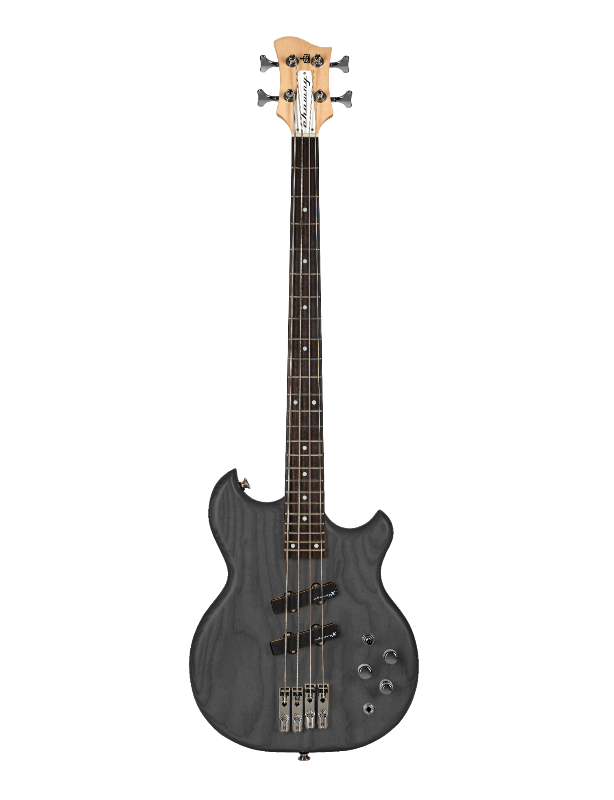
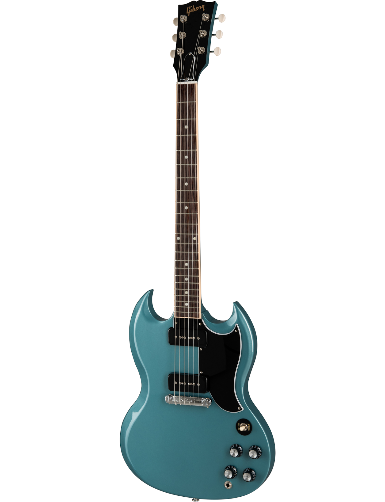
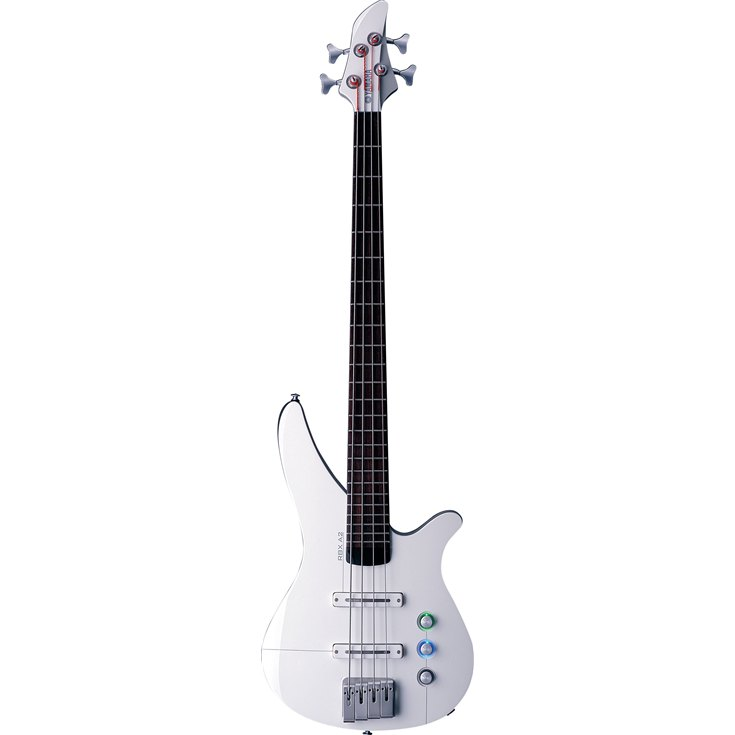

<!Doctype html>
<html lang="en">
  <head>
    <meta charset="utf-8">
    <meta name="viewport" content="width=device-width, initial-scale=1, shrink-to-fit=no">
    <link rel="stylesheet" href="https://stackpath.bootstrapcdn.com/bootstrap/4.4.1/css/bootstrap.min.css" integrity="sha384-Vkoo8x4CGsO3+Hhxv8T/Q5PaXtkKtu6ug5TOeNV6gBiFeWPGFN9MuhOf23Q9Ifjh" crossorigin="anonymous">
    
    <link href="https://fonts.googleapis.com/css2?family=Josefin+Sans&display=swap" rel="stylesheet"> 
    <link rel="stylesheet" type="text/css" href="style.css">
    <link rel="icon" type="text/css" href="images/Sound on3.png">
    <title>Sound Exploration©</title>
  </head>
  <body>
    

      

        

          

            <a href="https://twitter.com/FitrieAyie" class="mx-2">
              <i class="fab fa-twitter"></i>
            </a>
            <a href="https://www.instagram.com/fitrie.ayie/" class="mx-2">
              <i class="fab fa-instagram"></i>
            </a>
          

            <h6>AYIE MUSICS.🎸</h6>
          

        

      

      <header id="header">
        <nav id="navbar" class="navbar navbar-expand-md">
          
          
          <button class="navbar-toggler bg-light" type="button" data-toggle="collapse" data-target="#navbar">
            

            

            

          </button>
          

            <ul class="navbar-nav mx-auto">
              <li class="nav-item">
                <a href="#" class="nav-link m-2 text-capitalize nav-active">Home
                </a>
              </li>
              <li class="nav-item">
                <a href="#about" class="nav-link m-2 text-capitalize">About Us</a>
              </li>
              <li class="nav-item">
                <a href="#band" class="nav-link m-2 text-capitalize">Sponsored Band</a>
              </li>
              <li class="nav-item">
                <a href="#product" class="nav-link m-2 text-capitalize">Product</a>
              </li>
              <li class="nav-item">
                <a href="#SERVICES" class="nav-link m-2 text-capitalize">Accessories</a>
              </li>
              <li class="nav-item">
                <a href="#contact" class="nav-link m-2 text-capitalize">Contact Us</a>
              </li>
            </ul>
            <form class="from-inline ml-3">
              

                <input type="text" class="form-control" placeholder="search">
                

                  <button class="btn search-btn" type="button">
                    <i class="fas fa-search text-muted"></i>
                  </button>
                

              

            </form>
          

        </nav>
      </header>
    <!--Banner-->
    <section>
      

        

          

            <h1 class="display-2 text-uppercase">Welcome To Sound Exploration©.</h1>
            
Specialize by finding your tune of guitar from variety of Brands.

            <a href="#" class="btn btn-main btn-lg m-3">Contact Us</a>
            <a href="#" class="btn btn-main btn-lg m-3">Know More</a>
          

        

      

    </section>
  </header>

    <!--End Banner-->
    <section id="about">
      

        

          

            

              <h6>KNOW US MORE</h6>
              <h2 class="mb-4">ABOUT US</h2>
              
              
The best guitar selling provider stay on top for good reason so if you’re looking for a new acoustic or electric guitar it’s smart to start with the big names. Sound Exploration have built up reputations over the years by selling high-quality instruments used by some of the best guitar players in the world.

            

          
          
          

            <!--Items-->
            

              <i class="fab fa-fedex fa-4x mb-3"></i>
              <h5 class="p-3 font-weight-bold">
                FREE SHIPPING
              </h5>
              
 Courier Delivery Lead Time is the number of days it takes for your order to arrive starting from the day Sound Exploration Supported Logistics Partners has successfully picked up the order from the seller.

            

            <!--End Items-->
            <!--Items-->
            

             <i class="fas fa-hand-holding-usd fa-3x mb-3"></i>
              <h5 class="p-3 font-weight-bold">
                CUSTOMER CARE
              </h5>
              
 Sound Exploration is committed to protecting the data of our users and to complying with all applicable data protection and privacy laws. Below is a brief overview of how we collect, use and protect your personal data. It is very important to us to ensure that everyone using Sound Exploration has a safe and secure experience and understands how their personal data is collected and processed.
 

            

            <!--End Items-->
            <!--Items-->
            

              <i class="fas fa-certificate fa-3x mb-3"></i>
              <h5 class="p-3 font-weight-bold ">
                CERTIFIED BUY
              </h5>
              
 All request for refunds or order cancellation that has been successful will be able to see the refund process initiated within 24 hours. The refund process will be different according to the payment method used to pay for the order

            

            <!--End Items-->
          
         
        

      

    </section>
<!--Projects-->
<section class="projects py-3 " id="band">
  

    

      

        

          <h2 class="mb-4">OUR SPONSOR BAND</h2>
          
          
 Reprehenderit dolore nostrud officia ullamco anim labore in qui in sed id veniam occaecat do tempor magna labore in magna incididunt sed ut ut dolore consectetur exercitation deserunt enim pariatur laborum.

        

      
      
      

        <!---------image overlay---------->
        

          

            

              
            

            

              <h3 class="text-uppercase text-center text-dark px-3">
                Artic Monkeys
              </h3>
              
 Arctic Monkeys are an English rock band formed in Sheffield in 2002. The group consists of Alex Turner, Jamie Cook, Nick O'Malley, and Matt Helders. Former band member Andy Nicholson left the band in 2006 shortly after their debut album was released.

            

          
          
        

        <!---------end image overlay---------->
        
        <!---------image overlay---------->
        

          

            

              
            

            

              <h3 class="text-uppercase text-center text-dark px-3">
                The NBHD
              </h3>
              
 The Neighbourhood is an American alternative rock band formed in Newbury Park, California, in 2011. The band is composed of vocalist Jesse Rutherford, guitarists Jeremy Freedman and Zach Abels, bassist Mikey Margott, and drummer Brandon Alexander Fried.

            

          
          
        

        <!---------end image overlay---------->
        <!---------image overlay---------->
        

          

            

              
            

            

              <h3 class="text-uppercase text-center text-dark px-3">
                The 1975
              </h3>
              
 The 1975 are an English pop rock band formed in 2002 in Wilmslow, Cheshire. Now based in Manchester, the band consists of lead vocalist and rhythm guitarist Matthew Healy, lead guitarist Adam Hann, bassist Ross MacDonald, and drummer George Daniel.

            

          
          
        

        <!---------end image overlay---------->
         <!---------image overlay---------->
        

          

            

              
            

            

              <h3 class="text-uppercase text-center text-dark px-3">
                30 Sec To Mars
              </h3>
              
 Thirty Seconds to Mars is an American rock band from Los Angeles, California, formed in 1998. The band consists of brothers Jared Leto and Shannon Leto. During the course of its existence, it has undergone various line-up changes.

            

          
          
        

        <!---------end image overlay---------->
         <!---------image overlay---------->
        

          

            

              
            

            

              <h3 class="text-uppercase text-center text-dark px-3">
                My Chemical Romance
              </h3>
              
 My Chemical Romance is an American rock band from Newark, New Jersey. The band's current lineup consists of lead vocalist Gerard Way, guitarists Ray Toro and Frank Iero, and bassist Mikey Way.

            

          
          
        

        <!---------end image overlay---------->
         <!---------image overlay---------->
        

          

            

              
            

            

              <h3 class="text-uppercase text-center text-dark px-3">
                Nirvana
              </h3>
              
 Nirvana was an American rock band formed in Aberdeen, Washington, in 1987. Founded by lead singer and guitarist Kurt Cobain and bassist Krist Novoselic, the band went through a succession of drummers before recruiting Dave Grohl in 1990.

            

          
          
        

        <!---------end image overlay---------->
      

    

  

</section>
<!--End of Projects-->
<!--Projects-->
<section class="projects py-3">
  

    

      

        

          <h2 class="mb-4">CHOWNY BASS©</h2>

          
          
 With a range covering retro to modern instruments, each with their own unique hook, everybody will be able to find a Chowny they will love.

        

      
      
      

        <!---------image overlay---------->
        

          

            

              
            

            

              <h3 class="text-uppercase text-center text-dark px-3">
                 Electric Guitar
              </h3>
              
 The ClassicRocker-II CR2NS-F & CR2NS-R (H-H) pickups give the CR200 a warm vintage tone that complements its classic design.

              
RM 2,800

            

          
          
        

        <!---------end image overlay---------->
        
        <!---------image overlay---------->
        

          

            

              
            

            

              <h3 class="text-uppercase text-center text-dark px-3">
                Retrovibe Vantage
              </h3>
              
 Designed and styled by Retrovibe and manufactured by Chowny, the Vantage bass draws on many different styles, old and new, to deliver a robust and eye-catching design which sounds as good as it looks.

              
RM 3,500

            

          
          
        

        <!---------end image overlay---------->
        <!---------image overlay---------->
        

          

            

              
            

            

              <h3 class="text-uppercase text-center text-dark px-3">
                Tony Butler
              </h3>
              
 The Vantage is equipped with two MM-style humbuckers, each with their own volume and T4T tone controls, giving a huge range of single coil and humbucking tones.

              
RM 3,700

            

          
          
        

        <!---------end image overlay---------->
        <!---------image overlay---------->
        

          

            

              
            

            

              <h3 class="text-uppercase text-center text-dark px-3">
                NT5 Bass
              </h3>
              
 The Chowny NT5's body is comprised of a mixture of premium tonewoods, featuring Red Cedar and Maple. Together, these woods yield a potent mid-range, and the NT5 also features an Indian Walnut top for that premium look.

              
RM 5,200

            

          
          
        

        <!---------end image overlay---------->
        <!---------image overlay---------->
        

          

            

              
            

            

              <h3 class="text-uppercase text-center text-dark px-3">
                Retrovibe Stinger
              </h3>
              
 Retrovibe Stinger '77 pre-amp that is designed to the spirit of the original bass pre-amps to give a great unique bass tone, the EVO features a Red Cedar Body and Maple J-Profile neck with a satin finish and 24 fret maple fingerboard.

              
RM 5,500

            

          
          
        

        <!---------end image overlay---------->
        <!---------image overlay---------->
        

          

            

              
            

            

              <h3 class="text-uppercase text-center text-dark px-3">
                Scott Whitley
              </h3>
              
 Scott Whitley a professional gigging bassist (Big Country and formerly The Animals) the SWB-1 Scott Whitley Signature is designed to be a professional gigging bassists short scale bass.

              
RM 6,200

            

          
          
        

        <!---------end image overlay---------->
      

    

  

</section>
<!--End of Projects-->
<!--Projects-->
<section class="projects py-3" id="product">
  

    

      

        

          <h2 class="mb-4">GIBSON©</h2>

          
          
 The Gibson Custom Shop is the pinnacle of craftsmanship, quality and sound excellence. Each instrument celebrates Gibson’s legacy through accuracy, authenticity and attention to detail.

        

      
      
      

        <!---------image overlay---------->
        

          

            

              
            

            

              <h3 class="text-uppercase text-center text-dark px-3">
                 Gibson© Firebird
              </h3>
              
 The newly refreshed Firebird is outfitted with the redeveloped Alnico V Firebird pickup to recapture the scorching output and searing tones of the original voice for which the Firebird is known.

              
RM 2,300

            

          
          
        

        <!---------end image overlay---------->
        
        <!---------image overlay---------->
        

          

            

              
            

            

              <h3 class="text-uppercase text-center text-dark px-3">
                70s Rockers
              </h3>
              
 Iconic ‘70s classic is ready to take flight again. With its bound rosewood fingerboard, slim taper neck, and a pair of uncovered ‘70s tribute humbuckers all hand wired with Orange Drop capacitors, this V is set to nail all of the classic tones of the era..

              
RM 2,990

            

          
          
        

        <!---------end image overlay---------->
        <!---------image overlay---------->
        

          

            

              
            

            

              <h3 class="text-uppercase text-center text-dark px-3">
                Faded Pelham
              </h3>
              
 The two P-90 pickups are noted for their fat, snarl when driven and for their smooth, sweetness when played clean. The SG Special is equipped with the 3-way toggle switch, handwired controls and orange drop capacitors.

              
RM 3,400

            

          
          
        

        <!---------end image overlay---------->
        <!---------image overlay---------->
        

          

            

              
            

            

              <h3 class="text-uppercase text-center text-dark px-3">
                Antique Natural
              </h3>
              
 Gibson Flying V in 1958, the Gibson Explorer traveled where no man had gone before and past every guitar design that came before it. Over 60 years later the Gibson Explorer is utilized by artists of all genres making it one of the true classics of the guitar world.

              
RM 5,200

            

          
          
        

        <!---------end image overlay---------->
        <!---------image overlay---------->
        

          

            

              
            

            

              <h3 class="text-uppercase text-center text-dark px-3">
                Les Paul Special
              </h3>
              
Based on the Les Paul Junior with a slab mahogany body,fat 50s-style mahogany neck,rosewood fingerboard, wrap around bridge, an additional rhythm P-90 pickup, binding on the neck and additional controls for the rhythm pickup and the 3-way toggle switch.

              
RM 5,900

            

          
          
        

        <!---------end image overlay---------->
        <!---------image overlay---------->
        

          

            

              
            

            

              <h3 class="text-uppercase text-center text-dark px-3">
                Slash 1966 Doubleneck
              </h3>
              
 Slash's rise to rock royalty featured a variety of iconic Gibson models, but it was the 1966 EDS-1275 Doubleneck that both diversified his sound and solidified his guitar-god aesthetic.

              
RM 12,200

            

          
          
        

        <!---------end image overlay---------->
      

    

  

</section>
<!--End of Projects-->
<!--Projects-->
<section class="projects py-3">
  

    

      

        

          <h2 class="mb-4">YAMAHA©</h2>

          
          
 Like the world of rock and roll around them, guitars have always been shrouded in legend and myth. Our duty is to question every assumption, break down every component, and truly understand what makes for an amazing guitar. Nothing is sacred when your goal is perfection.

        

      
      
      

        <!---------image overlay---------->
        

          

            

              
            

            

              <h3 class="text-uppercase text-center text-dark px-3">
                 RBX4A2
              </h3>
              
 Fusing seamlessly with the player it offers unprecedented playing comfort that stuns bassists who regularly play a standard bass. Light weight, superior comfort, and easy playing action let you concentrate on your playing for extended periods of time. 

              
RM 3,400

            

          
          
        

        <!---------end image overlay---------->
        
        <!---------image overlay---------->
        

          

            

              
            

            

              <h3 class="text-uppercase text-center text-dark px-3">
                SLG200S
              </h3>
              
 The steel-string Silent Guitar SLG200S has always been an ideal instrument for practice, travel, and performing—and the new Crimson Red Burst finish adds a bold, modern aesthetic.

              
RM 3,790

            

          
          
        

        <!---------end image overlay---------->
        <!---------image overlay---------->
        

          

            

              
            

            

              <h3 class="text-uppercase text-center text-dark px-3">
                TRB1004J
              </h3>
              
 This is 4-string version of the monster bass, TRB series. TRB was born as a versatile 6-string bass guitar along with the greater involvement of synthesizers in music in end of 1980s. TRB has been developed to cover low tonal range with a 6th string.

              
RM 4,400

            

          
          
        

        <!---------end image overlay---------->
        <!---------image overlay---------->
        

          

            

              
            

            

              <h3 class="text-uppercase text-center text-dark px-3">
                JR2S
              </h3>
              
 JR2S features a solid Spruce top for superior tone and projection. The Side and Back is Mahogany UTF (Ultra Thin Film) that offers beautiful looks. The instrument comes with a durable case.

              
RM 4,650

            

          
          
        

        <!---------end image overlay---------->
        <!---------image overlay---------->
        

          

            

              
            

            

              <h3 class="text-uppercase text-center text-dark px-3">
                TRB1005J
              </h3>
              
This is 5-string version of the monster bass, TRB series. TRB was born as a versatile 6-string bass guitar along with the greater involvement of synthesizers in music in end of 1980s. TRB has been developed to cover low tonal range with a 6th string.

              
RM 5,100

            

          
          
        

        <!---------end image overlay---------->
        <!---------image overlay---------->
        

          

            

              
            

            

              <h3 class="text-uppercase text-center text-dark px-3">
                BB425X
              </h3>
              
 BB425X is a pickguard version of BB425. BB425X makes the sound, feel and looks driven by the incredible BB2000 series basses available to every player.

              
RM 5,590

            

          
          
        

        <!---------end image overlay---------->
      

    

  

</section>
<!--End of Projects-->
<!--Projects-->
<section class="projects py-3">
  

    

      

        

          <h2 class="mb-4">ADD ONS</h2>

          
          
 Compiling your music taste mith variety of accesories designed just for you!

        

      
      
      

        <!---------image overlay---------->
        

          

            

              
            

            

              <h3 class="text-uppercase text-center text-dark px-3">
                 D'Addario Paisley
              </h3>
              
 Designed for players of all genres, D'Addario woven straps offer designs that will please even the most discerning player. From iconic themes to unique patterns and artwork, these durable straps are sure to accent any guitar and are adjustable from 35" to 59.5" long. 

              
RM 120

            

          
          
        

        <!---------end image overlay---------->
        
        <!---------image overlay---------->
        

          

            

              
            

            

              <h3 class="text-uppercase text-center text-dark px-3">
                Japanese Suede
              </h3>
              
 2″ Polyester Guitar Strap Sublimation-printed With Original Artist’s Design, Genuine Leather Ends And Tri-glide Adjustment. Adjustable To 65″.

              
RM 167

            

          
          
        

        <!---------end image overlay---------->
        <!---------image overlay---------->
        

          

            

              
            

            

              <h3 class="text-uppercase text-center text-dark px-3">
                Levys
              </h3>
              
 2" polyester guitar strap sublimation-printed with original artist's design, with polyester ends and tri-glide adjustment. Adjustable to 60".

              
RM 4,400

            

          
          
        

        <!---------end image overlay---------->
        <!---------image overlay---------->
        

          

            

              
            

            

              <h3 class="text-uppercase text-center text-dark px-3">
                Hard Rock© Pick
              </h3>
              
 Much like with guitar stands, guitar picks (properly called a plectrum or plectra) aren’t exactly the first thing you think of when you start playing. If you opt for a beginner guitar kit, they usually toss a few in there to get you started. Generally, these are standard, plain celluloid picks of medium thickness.

              
RM 26 each

            

          
          
        

        <!---------end image overlay---------->
        <!---------image overlay---------->
        

          

            

              
            

            

              <h3 class="text-uppercase text-center text-dark px-3">
                Gibson Stickers
              </h3>
              
Stickers to spices up your guitar

              
RM 35

            

          
          
        

        <!---------end image overlay---------->
        <!---------image overlay---------->
        

          

            

              
            

            

              <h3 class="text-uppercase text-center text-dark px-3">
                Yorkville Stand
              </h3>
              
  Economical solution for acoustic & electric guitars or basses. All metal design. Secure instrument cradle. Wide base for increased stability

              
RM 230

            

          
          
        

        <!---------end image overlay---------->
      

    

  

</section>
<!--End of Projects-->
<!---------------------Services------------------------>
<section class="services p-5" id="SERVICES">
  

    

      <!------Title------->
      

        <h2 class="mb-4">ACCESSORIES</h2>
        
        
Though they may be a relatively small and inexpensive purchase, guitar accessories are a fundamental aspect of your tone

      

      <!------End Title------->
    

  

  

    

      

        

          <!---left services-->
          

            

              <i class="fas fa-align-center fa-3x"></i>
            

            <!---Title details--->
            <h3>Strings</h3>
            
 Dozens of manufacturers make acoustic guitar strings, from giant brands down to small boutique shops. D’Addario, Ernie Ball, Martin, Elixir, Gibson, and Dean Markley.

          

          <!---end left services-->
          <!---left services-->
          

            

              <i class="fas fa-guitar fa-3x"></i>
            

            <!---Title details--->
            <h3>Body</h3>
            
 Came from variety of body designs like Stratocaster® Style, Telecaster®, Vintage, Warmoth, Hotrod and 7 String to suit your tunes

          

          <!---end left services-->
          <!---left services-->
          

            

              <i class="fas fa-toolbox fa-3x"></i>
            

            <!---Title details--->
            <h3>Marshall© Amplifier</h3>
            
 A  small version of the Silver Jubilee. Originally released in 1987 to mark 25 years of Marshall the Silver Jubilee became a favourite with guitar legends such as Slash and John Frusciante for its ferocious tone and split-channel design.

          

          <!---end left services-->
        

        

          

            
          

        

          

            <!---right service---->
            

              

                <i class="fas fa-egg fa-3x"></i>
              

              <h3>Picker</h3>
              
 Thickness available: 0.50 (Red), 0.60 (Orange), 0.73 (Yellow), 0.88 (Green), 1.0 (Blue), 1.14 (Purple) mm

            

            <!---end right service---->
             <!---right service---->
            

              

                <i class="fas fa-music fa-3x"></i>
              

              <h3>Tuning Keys</h3>
              
 The PRL-8341-B0 is a set of Ratio Locking Tuned Machine Heads for an electric guitar that uses three a side tuners. It has a vintage shaped button, has a two pin casing and is finished in black.

            

            <!---end right service---->
             <!---right service---->
            

              

                <i class="fas fa-tasks fa-3x"></i>
              

              <h3>Quality</h3>
              
 The PRL-8341-B0 is a set of Ratio Locking Tuned Machine Heads for an electric guitar that uses three a side tuners. It has a vintage shaped button, has a two pin casing and is finished in black.

            

            <!---end right service---->
          
        
      

    

  

</section>
<!-------------------End Service---->
<!-------Brands--------->
<section id="testimonial" class="py-5">
  

    

      <!---carousel item---->
      

        

          

            

              

                
              

              

                <h2 class="text-capitalize mb-3 des-color">MARSHALL©</h2>
                
Marshall has been celebrated by some of the world’s greatest bands and musicians including: Jimi Hendrix, Eric Clapton, Slash, Oasis, Muse, Gorillaz and Bring Me The Horizon.

              

            

          

        

      

      <!-----------End of carousel------------------->
       <!---carousel item---->
      

        

          

            

              

                
              

              

                <h2 class="text-capitalize mb-3 des-color">GIBSON©</h2>
                
Orville Gibson patented a single-piece mandolin design in 1898 that was more durable than other mandolins and could be manufactured in volume. Orville Gibson began to sell his instruments in 1894 out of a one-room workshop in Kalamazoo, Michigan.

              

            

          

        

      

      <!-----------End of carousel------------------->
       <!---carousel item---->
      

        

          

            

              

                
              

              

                <h2 class="text-capitalize mb-3 des-color">YAMAHA©</h2>
                
 More than 130 years after our founding in 1887, we defined the Yamaha Philosophy as the philosophical framework that underpins business management at the Yamaha Group.

              

            

          

        

      

      <!-----------End of carousel------------------->     
       <!---carousel item---->
      

        

          

            

              

                
              

              

                <h2 class="text-capitalize mb-3 des-color">JBL©</h2>
                
 JBL was founded by James Bullough Lansing (1902–1949) who was an American audio engineer and loudspeaker designer most notable for establishing two audio companies that bear his name.

              

            

          

        

      

      <!-----------End of carousel------------------->     
    

    <a class="carousel-control-prev" href="#carouselExampleControls" role="button" data-slide="prev">
      
    </a>
    <a class="carousel-control-next" href="#carouselExampleControls" role="button" data-slide="next">
      
    </a>
  

</section>
<!----------------Contact Us----------------->
<section class="p-5" id="contact">
  

    

      

        

          <h2 class="mb-4">CONTACT ME</h2>
          
          
 Contact Me for any inquiries and feel free to contact through our numbers and email

        

      

      

        

          <i class="fas fa-mobile-alt fa-3x color"></i>
          <h5 class="mt-3">Phone</h5>
          
(+60) 018-3673771

        

        

          <i class="fas fa-map-marker-alt fa-3x color"></i>
          <h5 class="mt-3">Address</h5>
          
7, Jalan Bintang, Bukit Bintang, 55100 Kuala Lumpur, Wilayah Persekutuan Kuala Lumpur

        

        

          <i class="far fa-envelope-open fa-3x color"></i>
          <h5 class="mt-3">Email</h5>
          
fitriemuh99@gmail.com

        

      

      <!---google Map--------->
            

              <iframe src="https://www.google.com/maps/embed?pb=!1m18!1m12!1m3!1d3983.8127828559236!2d101.70777371445347!3d3.144064897710669!2m3!1f0!2f0!3f0!3m2!1i1024!2i768!4f13.1!3m3!1m2!1s0x31cc3629019c8661%3A0x584753437f2a7287!2sLow%20Yat%20Plaza!5e0!3m2!1sen!2smy!4v1590687456764!5m2!1sen!2smy" width="600" height="450" frameborder="0" style="border:0;" allowfullscreen="" aria-hidden="false" tabindex="0"></iframe>
            

      <!---End google Map--------->
      

        

          <form>
            

              

                
                  <i class="fas fa-user"></i>
                
              

              <input type="text" class="form-control" placeholder="Name">
            

            

              

                
                  <i class="fas fa-envelope"></i>
                
              

              <input type="text" class="form-control" placeholder="Email">
            

            

              

                
                  <i class="fas fa-pencil-alt"></i>
                
              

              <textarea class="form-control" placeholder="Message" rows="5"></textarea>
            

            <input type="submit" value="Submit" class="btn btn-cont btn-block btn-lg">
          </form>
        

      

    

  

</section>

<!-------End of Brands--------->

    
    
    
  </body>
</html>
